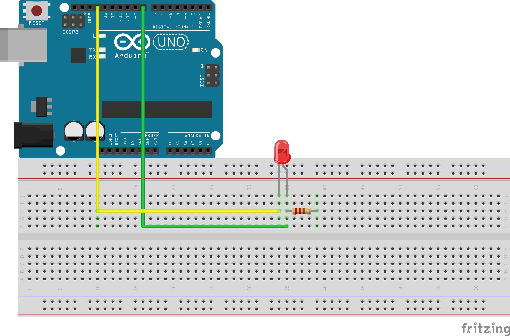
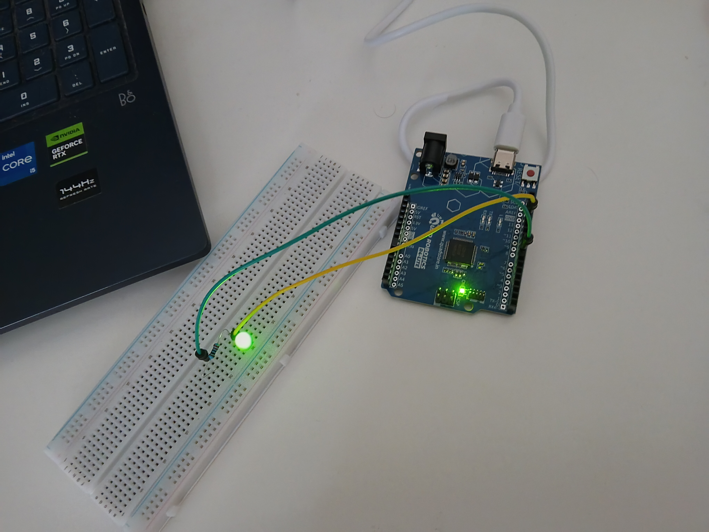

# External LED Blink with Arduino

## Description
Basic project to blink an external LED connected to Pin 13 using Arduino Uno.

## Components Used
- Arduino Uno
- 1x Red LED
- 1x 220Ω Resistor
- Breadboard
- Jumper wires

## Circuit Diagram



## Code
```cpp
int led = 8;
void setup() {
pinMode(led, OUTPUT);
}
void loop() {
digitalWrite(led, HIGH);
delay(1000);
digitalWrite(led, LOW);
delay(1000);
}
