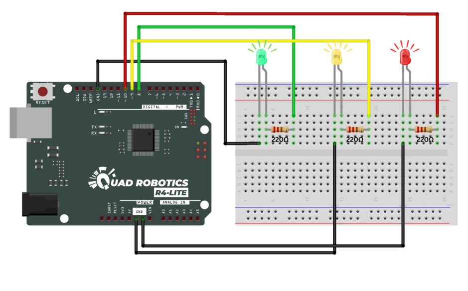

# Traffic lights with Arduino

## Description
Basic project to simulate a traffic light system using Arduino

## Components used
- Arduino Uno
- 1x Red LED
- 1x Green LED
- 1x Yellow LED
- 3x 220Ω Resistor
- Breadboard
- Male to Male Jumper wires
- C USB port

## Circuit Diagram


## Project Video


## Code
```cpp
int red = 10;
int yellow = 9;
int green = 8;
void setup() {
pinMode(red, OUTPUT);
pinMode(yellow, OUTPUT);
pinMode(green, OUTPUT);
}
void loop() {
digitalWrite(red, HIGH);
delay(3000);
digitalWrite(red, LOW);
digitalWrite(yellow, HIGH);
delay(1000);
digitalWrite(yellow, LOW);
digitalWrite(green, HIGH);
delay(3000);
digitalWrite(green, LOW);
}
