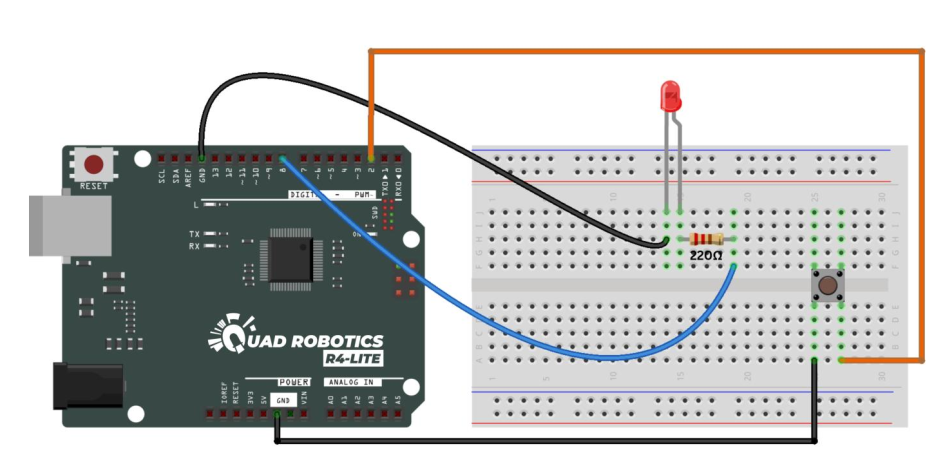
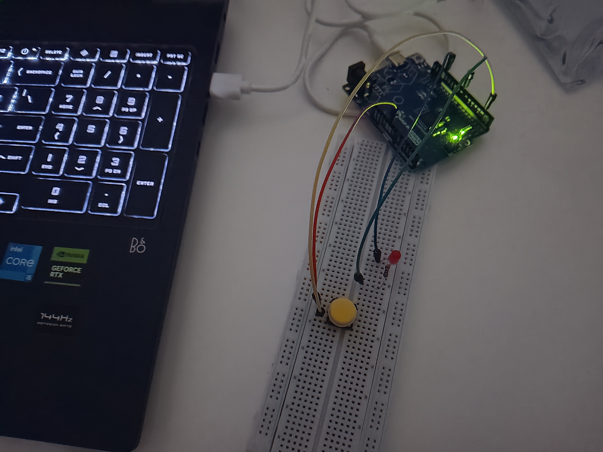
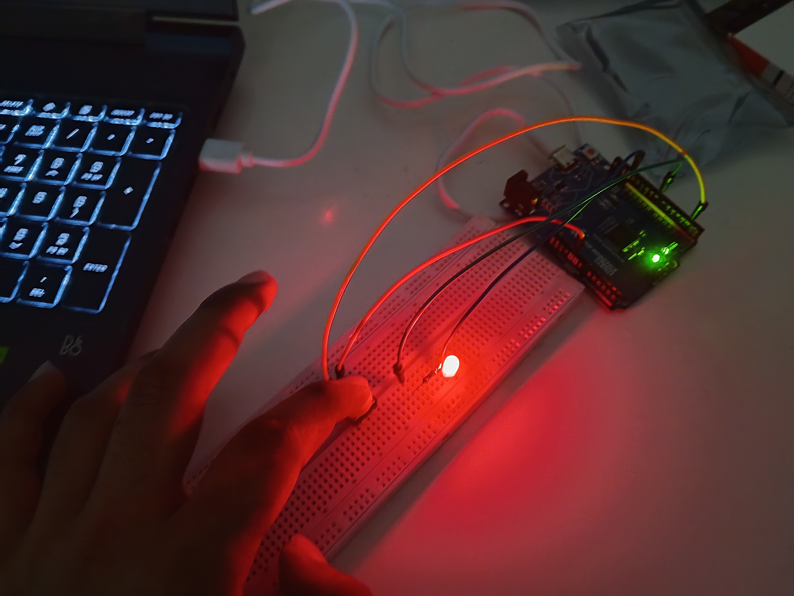

# EPress button to light LED

## Description
Basic project to experiment buttons

## Components Used
- Arduino Uno
- 1x Red LED
- 1x 220Ω Resistor
- 1x Push button switch
- Male to Male Jumper wires


## Circuit Diagram


## Project Images



## Code
```cpp
const int buttonPin = 2;
const int ledPin = 8;
void setup() {
pinMode(buttonPin, INPUT_PULLUP); // internal pull-up
pinMode(ledPin, OUTPUT);
}
void loop() {
int buttonState = digitalRead(buttonPin);
if (buttonState == LOW) {
// button pressed
digitalWrite(ledPin, HIGH);
} else {
digitalWrite(ledPin, LOW);
}
}
